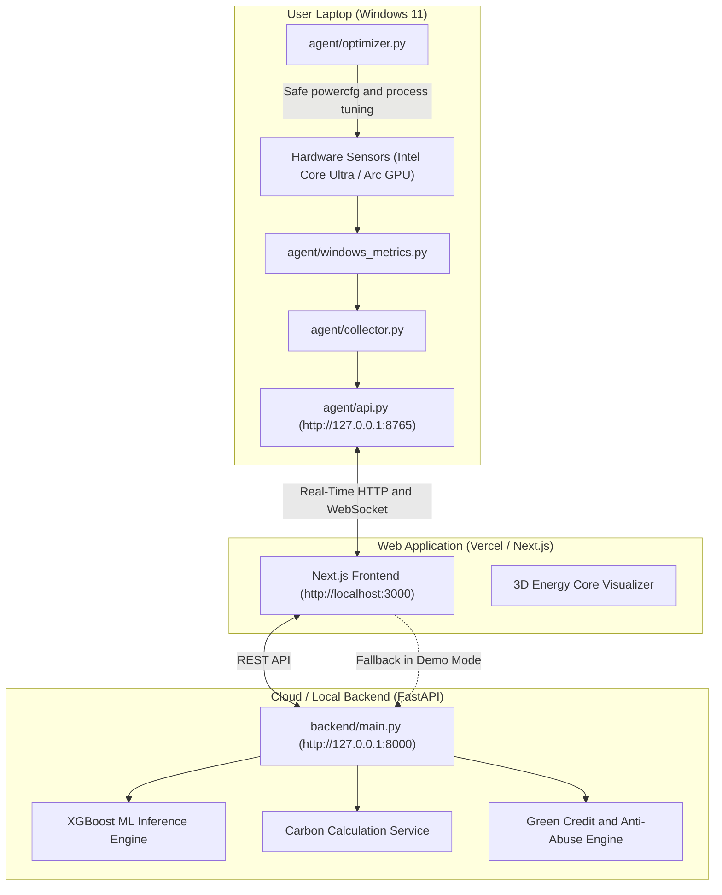

# GreenLedger — System Architecture Documentation

## Executive Overview
GreenLedger is a local-first sustainable computing platform that bridges native Windows 11 hardware telemetry with physics-calibrated machine-learning inference, carbon accounting, and verified optimization trials.

---

## High-Level System Architecture

---

## Architectural Principles

### 1. Separation of Concerns & Browser Sandbox Realism
Web browsers cannot access arbitrary operating system hardware counters directly due to browser security sandbox constraints. Rather than faking telemetry in the browser, GreenLedger implements a native Windows background agent running on `http://127.0.0.1:8765`.

### 2. Dual-Mode Operational Flexibility
- **Live Device Mode**: The Next.js frontend queries the local agent at `http://127.0.0.1:8765` for actual Intel processor and system counters.
- **Demo Mode**: If the dashboard is opened by remote hackathon judges on macOS, Linux, or mobile devices where the agent is not installed, the platform seamlessly switches to a deterministic, realistic simulated telemetry stream clearly labeled as **"Demo Mode (Simulated)"**.

### 3. Local Verification and Learning
- Real-time telemetry, preprocessing, XGBoost inference, and optimization execution run locally for low latency and privacy.
- Before/after trials are stored locally and used to improve recommendation confidence for the current device.
